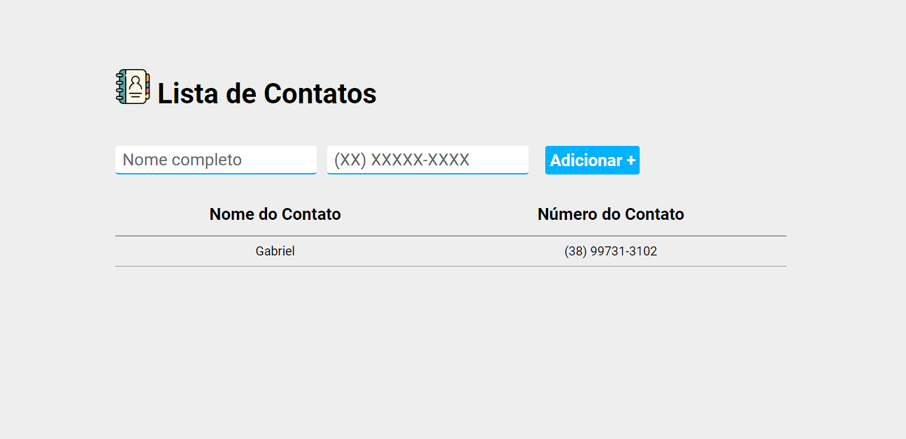

# Projeto Web - Minha Jornada de Aprendizado Continua 🌟

Este repositório contém meu segundo projeto de desenvolvimento web, um testemunho da minha contínua evolução e aprendizado nesta área empolgante.

## Estrutura do Projeto

O projeto é composto pelos seguintes arquivos e diretórios:

- `index.html`: O arquivo HTML principal que contém a estrutura da página web.
- `main.css`: Um arquivo CSS que define os estilos da página web.
- `main.js`: Um arquivo JavaScript que adiciona funcionalidades interativas ao site.
- `Contatos.png`: Uma imagem usada no site.

## Tecnologias Usadas

- **HTML**: Para a estrutura da página web.
- **CSS**: Para estilização e design responsivo.
- **JavaScript**: Para funcionalidades interativas.

## Como Visualizar o Site

Para visualizar o site, basta abrir o arquivo `index.html` em qualquer navegador web moderno.

## Minha Evolução

Este projeto, junto com meus projetos anteriores, demonstra meu compromisso e crescimento contínuo no campo do desenvolvimento web. Estou empolgado para continuar aprendendo, aprimorando minhas habilidades e trabalhando em projetos mais complexos no futuro.

Agradeço por visitar este projeto e encorajo feedbacks e sugestões para melhorias futuras!

#DesenvolvimentoWeb #Aprendizado #ProjetoWeb #Crescimento #Evolução

